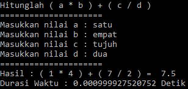

## Latar Belakang Masalah :
1. Kecerdasan Buatan
2. Efektif dan Efisien

## Kecerdasan Buatan
Pertama-tama kita pahami dulu apa pengertian cerdas dan buatan. Cerdas menurut setiap orang itu pengertiannya berbeda-beda, ada yang mengatakan orang cerdas itu adalah yang mengetahui segala hal atau ilmu dan banyak lagi definisi lainnya. Dalam pembahasan ini cerdas dapat diartikan cepat dan tepat.

* Cepat berarti tidak menghabiskan waktu untuk hal yang tidak perlu, selesai pada waktunya atau sebelum waktu yang ditetapkan.
* Tepat artinya kena sasaran, mencapai target sesuai pada waktunya.

Sedangkan buatan atau artifisial adalah tidak alami atau merekayasa segala seuatu baik itu bentuk, sifat, cara kerja atau sesuatu yang memiliki kemampuan cepat dan tepat.

## Efektif dan Efisien
Efektif adalah melakukan sesuatu yang sesuai dengan apa yang diinginkan atau tapat sasaran. Sedangkan Efisien adalah bagaimana cara melakukan sesuatu dengan sumber daya yang minimum tapi pencapaiannya optimum. Perbedaan efektif dan efisien adalah sebagai berikut :
* Efektif berarti melakukan sesuatu yang benar (<i>do the right thing</i>) atau bisa dikatakan tepat sasaran.
* Efisien lebih kearah melakukan sesuatu dengan benar (<i>do the thing right</i>) atau bisa dikatakan tepat guna.

Dibawah ini terdapat contoh hasil kode aritmatika perhitungan dengan menggunakan bahasa python yang diinput dengan huruf dan outputnya hasil dan durasi waktu pemrosesan.

## Kesimpulan
Jadi, cerdas dapat diartikan juga cepat dan tepat, cepat berarti menyelesaikan sesuatu pada waktunya atau sebelum waktu yang ditetapkan, dan tepat berarti sesuai pada waktunya. Sedangkan Buatan adalah rekayasa baik itu bentuk, sifat, dan cara kerja. Kecerdasan Buatan juga memiliki bagian efektif dan efisien, efektif bisa dikatakan tepat sasaran dan efisien bisa dikatakan tepat guna.

## Saran
Diharapkan memahami materi dan tugas secara mendetail.
 
* Nama : Bayu Rahmad Azhari
* NPM : 1144125
* Kelas : 3C
* Prodi : D4 Teknik Informatika
* Kampus : Politeknik Pos Indonesia

Link Matakuliah : http://kampus.awangga.net/home/kelassistemmultimediadankecerdasanbuatan2017

Referensi :
* https://id.wikipedia.org/wiki/Kecerdasan_buatan
* http://gundayaini.tumblr.com/post/16612165968/perbedaan-efektif-dan-efisien

Scan Plagiarisme :
* https://drive.google.com/open?id=0B5FSMUsdCMU4LTBodmQxOXlSWFE
* https://drive.google.com/open?id=0B5FSMUsdCMU4d1Rxd19GLTFKTFE 