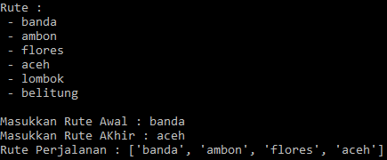

## Latar Belakang Masalah :
1. Pengertian Representasi Pengetahuan
2. Fungsi Representasi Pengetahuan

## Pengertian Representasi Pengetahuan
Pengertian representasi itu terdiri dari re artinya mengulang dan presentasi artinya menyajikan atau memaparkan, sedangkan pengetahuan berasal dari kata tahu, apakah perbedaan tahu dengan paham? Jawabannya jika Anda tahu belum tentu Anda paham, tapi jika Anda paham sudah pasti Anda tahu, jadi tahu itu adalah proses berfikir untuk menjadi paham. Representasi pengetahuan adalah cara untuk memaparkan pengetahuan yang diperoleh secara diulang ke dalam suatu skema sehingga dapat digunakan untuk menguji kebenaran penalarannya. Jadi representasi pengetahuan digunakan untuk memecahkan masalah menggunakan mesin komputer, seperti yang diketahui komputer tidak bisa melakukan proses berfikir, tetapi komputer melakukan tindakan berdasarkan fakta dan tidakan selanjutnya. Contohnya adalah sebagai berikut : 
<u>Fakta :<u> 
Budi adalah laki-laki 
Ani adalah Perempuan  
<u>Representasi :<u> 
Laki-laki(Budi) 
Perempuan(Ani)

## Fungsi Representasi Pengetahuan
* Digunakan untuk merancang komputer agar dapat mengambil keputusan seperti manusia untuk memecahkan masalah.
* Digunakan juga untuk membatasi sebuah masalah.

Dibawah ini terdapat contoh hasil kode rute perjalanan dengan menggunakan bahasa python yang diinput dengan rute awal dan rute akhir sedangkan outputnya rute perjalanan awal sampai akhir.

## Kesimpulan
Jadi, representasi pengetahuan adalah cara untuk memaparkan pengetahuan yang diperoleh secara diulang ke dalam suatu skema sehingga dapat digunakan untuk menguji kebenaran penalarannya dan biasa digunakan untuk merancang komputer agar dapat mengambil keputusan seperti manusia untuk memecahkan masalah.

## Saran
Diharapkan memahami materi dan tugas secara mendetail.
 
* Nama : Bayu Rahmad Azhari
* NPM : 1144125
* Kelas : 3C
* Prodi : D4 Teknik Informatika
* Kampus : Politeknik Pos Indonesia

Link Matakuliah : http://kampus.awangga.net/home/kelassistemmultimediadankecerdasanbuatan2017

Referensi :
* http://lutfiatulm.blogspot.co.id/2013/03/representasi-pengetahuan.html
* https://yuiteen88.wordpress.com/2009/12/07/representasi-pengetahuan-ai-pertemuan-ke-2-dan-ke-3/

Scan Plagiarisme :
* https://drive.google.com/file/d/0B5FSMUsdCMU4LVIzUFc3dXIzMGs
* https://drive.google.com/file/d/0B5FSMUsdCMU4djRxeXlqaHR0cGs