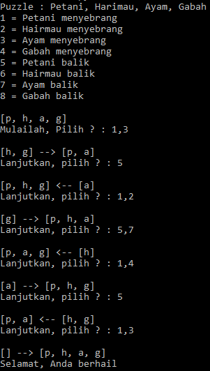

## Latar Belakang Masalah :
1. Reasoning
2. Semantic Network
3. Frame

## Reasoning
Reasoning adalah cara merepresentasikan fakta yang disajikan secara formal. Perhatikan contoh permasalahan dibawah ini :
* Budi adalah laki-laki
* Semua laki-laki adalah manusia
Jadi, pertanyaannya adalah “Apakah Budi manusia ?”, jawabannya direpresentasi sebagai berikut :
* Manusia(Budi)

## Semantic Network
Semantic Network adalah representasi yang mengepresikan solusi permasalahan dengan menggunakan graph berarah. Semantic Network adalah representasi yang bersifat :
* Lexically, terdiri dari node, link dan batasan-batasan khusus dari permasalahan.
* Structurally, link yang terkoneksi dari head node ke tail node.
* Semantically, semua node dan link yang direpresentasikan sebagai pembatas masalah.

Contohnya adalah permasalahan manusia, harimau, ayam, dan gabah. Manusia ingin memindahkan dirinya sendiri, harimau, ayam, dan gabah menyebrangi sungai. Tapi perahunya hanya bisa membawa manusia dan satu penyebrangan saja. Manusia juga tidak bisa meninggalkan harimau dan ayam dalam satu tempat karena harimau akan memangsa ayam, dan manusia juga tidak bisa meninggalkan ayam dengan gabah dalam satu tempat. 
Dibawah ini terdapat contoh hasil program penyebrangan sungai dengan menggunakan bahasa python.

## Frame
Frame adalah representasi atau penyajian berorientasi objek. Kelebihan menggunakan frame sebagai representasi pengetahuan adalah :
* Memperjelas informasi tentang permasalahan yang sesuai.
* Mampu membatasi nilai-nilai yang dibutuhkan oleh atribut.
* Lebih mudah dibaca.
* Mendukung mekanisme inheritance dalam informasi.
Contoh sebuah frame adalah sebagai berikut :

## Kesimpulan
Jadi, reasoning adalah cara mempresentasikan fakta yang disajikan secara formal, semantic network adalah representasi yang mengepresikan solusi permasalahan dengan menggunakan graph berarah dan frame adalah representasi atau penyajian berorientasi objek.

## Saran
Diharapkan memahami materi dan tugas secara mendetail.
 
* Nama : Bayu Rahmad Azhari
* NPM : 1144125
* Kelas : 3C
* Prodi : D4 Teknik Informatika
* Kampus : Politeknik Pos Indonesia

Link Matakuliah : http://kampus.awangga.net/home/kelassistemmultimediadankecerdasanbuatan2017

Referensi :
* http://entin.lecturer.pens.ac.id/Kecerdasan%20Buatan/Buku/Bab%203%20Reasoning,%20Semantic%20Network,%20Frame.pdf 

Scan Plagiarisme :
* https://drive.google.com/open?id=0B5FSMUsdCMU4WVBYRERRYXk5VnM
* https://drive.google.com/open?id=0B5FSMUsdCMU4R1VTV29KdFNFY0k 
