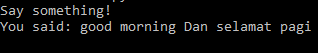

## Latar Belakang Masalah :
1. Pengolahan Bahasa Alami
2. Bidang Pengetahuan Dalam Natural Language
3. Speech Recognition

## Pengolahan Bahasa Alami
Pengolahan bahasa alami atau dalam bahasa inggris natural language processing mengacu pada metode kecerdasan buatan digunakan untuk berkomunikasi dengan komputer menggunakan bahasa keseharian manusia. Sebuah sistem bahasa alami juga harus diperhatikan dari segi kata yang digunakan, arti kata tersebut, kata-kata yang digabung untuk menghasilkan suatu kalimat dan lain sebagainya. Tetapi ada satu hal juga yang harus dipertimbangkan, yaitu kemampuan manusia untuk mengerti bahasa yang digunakan untuk berkomunikasi.

## Bidang Pengetahuan Dalam Natural Language
1. Fonetik dan fonologi

Fonetik dan fonologi merupakan pengetahuan yang digunakan untuk mendeteksi suara menjadi sebuah kata yang dapat dikenali. 
Contoh : Siri, Cortana, Google Assitant dan lain sebagainya.

2.	Morfologi

Morfologi merupakan pengetahuan tentang pembentukan kata dari kata dasar. 
Contoh : menyanyi -> me-nyanyi.

3.	Sintaksis

Sintaksis merupakan pengetahuan tentang pembentukan urutan kata dalam kalimat atau pembentukan aturan baku sebuah kalimat.

4.	Semantik

Semantik mempelajari suatu arti kata dan arti kata tersebut membentuk suatu arti dari kalimat yang utuh. 

5.	Pragmantik

Pragmatik merupakan pengetahuan yang berorientasi pada tujuan dan situasi pembuatan sistem.

6.	Discourse Knowledge

Discourse Knowledge melakukan pengenalan suatu kata yang sudah dibaca sebelumnya akan berpengaruh pada arti kata selanjutnya.

7.	World Knowledge

World Knowledge mencakup arti khusus suatu kalimat.

## Speech Recognition
SpeechRecognition merupakan library python untuk melakukan pengenalan suara, dengan dukungan beberapa mesin dan API, online dan offline. Dibawah ini akan dijelaskan bagaimana cara menginstall dan apa saja yang dibutuhkan sebelum menginstall SpeechRecognition pada sistem operasi Windows. 
Pertama, install terlebih dahulu pyaudio yang digunakan untuk menginput micropone.
~~~
pip install pyaudio
~~~
Selanjutnya install PocketSphinx untuk menggunakan Sphinx recognizer.
~~~
pip install wheel
~~~
Lalu install Google API Client Library for Python untuk menggunakan Google Cloud Speech API.
~~~
pip install google-api-python-client
~~~
Terakhir install SpeechRecognition.
~~~
pip install SpeechRecognition
~~~
Selesai. 
Dibawah ini juga terdapat contoh hasil program mengubah suara ke teks menggunakan library SpeechRecognition.

## Kesimpulan
Jadi, pengolahan bahasa alami mengacu pada metode kecerdasan buatan digunakan untuk berkomunikasi dengan komputer menggunakan bahasa keseharian manusia dan terdapat beberapa bidang yang berhubungan dengan pengolahan bahasa alami. Dan untuk praktikum coba gunakan library python SpeechRecognition untuk melakukan pengenalan suara.

## Saran
Diharapkan memahami materi dan tugas secara mendetail.
 
* Nama : Bayu Rahmad Azhari
* NPM : 1144125
* Kelas : 3C
* Prodi : D4 Teknik Informatika
* Kampus : Politeknik Pos Indonesia

Link Matakuliah : http://kampus.awangga.net/home/kelassistemmultimediadankecerdasanbuatan2017

Referensi :
* https://www.tutorialspoint.com/artificial_intelligence/artificial_intelligence_natural_language_processing.htm
* http://entin.lecturer.pens.ac.id/Kecerdasan%20Buatan/Buku/Bab%205%20Natural%20Language%20Processing.pdf 
* https://pypi.python.org/pypi/SpeechRecognition/  

Scan Plagiarisme :
* https://drive.google.com/open?id=0B5FSMUsdCMU4ZWFTX01HZkkzMlk
* https://drive.google.com/open?id=0B5FSMUsdCMU4Mllock1GUzNYdGs 