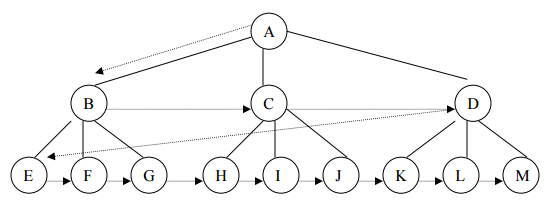
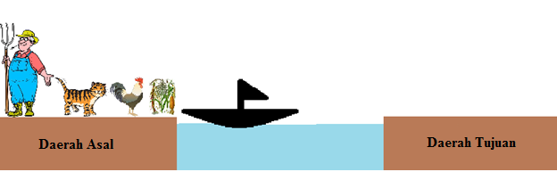
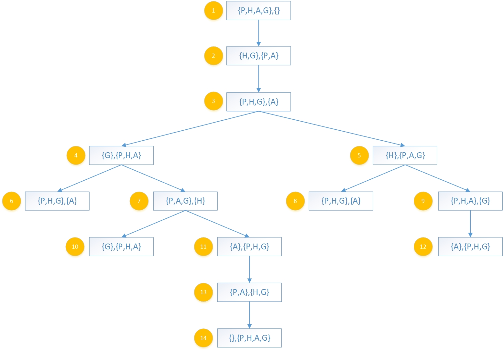

## Latar Belakang Masalah :
1. Breadth-First Search (BFS)
2. Cara Kerja Algoritma BFS
3. Kelebihan dan Kekurangan BFS

## Breadth-First Search (BFS)
Algoritma Breadth-First Search (BFS) atau algoritma pencarian melebar pertama adalah sebuah algoritma pencarian graf dari simpul akar dan mengunjungi semua simpul yang berdekatan atau kombinasi dari urutan dengan menggunakan semua solusi secara sistematis. Pada BFS semua simpul pada level n akan dikunjungi terlebih dahulu sebelum mengunjungi simpul-simpul pada level n+1. Pencarian dimulai dari simpul akar, kemudian dilanjutkan ke simpul level ke-1 dari kiri ke kanan, kemudian dilanjutkan ke level berikutnya dari kiri ke kanan juga hingga ditemukan solusinya.

## Cara Kerja Algoritma BFS
Dalam Algoritma BFS, simpul anak yang telah dikunjungi akan dimasukkan ke dalam suatu antrian. Antrian ini digunakan agar mengacu simpul-simpul yang berdekatan dengannya yang akan dikunjungi selanjutnya sesuai urutan. Berikut ini adalah langkah-langkah algoritma BFS :
1. Masukkan simpul akar ke dalam antrian.

2. Ambil simpul dari awal antrian, lalu lakukan pengecekan apakah simpul merupakan solusi.

3. Jika simpul merupakan solusi, maka pencarian selesai.

4. Jika simpul bukan solusi, makan masukkan semua simpul yang berdekatan dengan simpul tersebut ke dalam antrian

5. Jika antrian kosong, dan solusi tidak ditemukan, maka pencarian selesai.

6. Ulangi pencarian dari langkah ke-2

Contoh penerapan BFS : 
Studi kasus : Seorang petani mempunyai seekor harimau dan ayam, dan petani juga mempunyai sekantong gabah. Petani tersebut hendak pindah kedaerah yang baru di seberang sungai, untuk sampai kedaerah yang baru ia harus menyebrangi sungai tersebut. 

Permasalahannya : Disungai tersebut hanya tersedia 1 perahu yang hanya bisa memuat petani dan satu penumpang lainnya (harimau, ayam atau gabah). Jika petani meninggalkan harimau dan ayam dalam satu daerah sama, maka harimau akan memangsa ayam dan begitu juga dengan gabah tidak bisa di tinggalkan dengan ayam dalam satu daerah yang sama.

Deskripsi :
* P = Petani
* H = Harimau
* A = Ayam
* G = Gabah

Keadaan Awal :
* Daerah Asal = (P, H, A, G)
* Daerah Tujuan = (0, 0, 0, 0)

Tujuan :
* Daerah Asal = (0, 0, 0, 0)
* Daerah Tujuan = (P, H, A, G)

## Kelebihan dan Kekurangan BFS
Kelebihan :
1. Tidak akan menemukan jalan buntu.

2. Tidak ada solusi, maka breadth-first search akan menemukannya.

3. Jika ada lebih dari satu solusi, maka solusi paling minimum akan ditemukan.

Kekurangan :
1. Memerlukan memori yang cukup banyak.

2. Memerlukan waktu yang cukup lama.

## Kesimpulan
Jadi, algoritma Breadth-First Search (BFS) atau algoritma pencarian melebar pertama adalah sebuah algoritma pencarian graf dari simpul akar dan mengunjungi semua simpul yang berdekatan atau kombinasi dari urutan dengan menggunakan semua solusi secara sistematis. Dan dalam Algoritma BFS, simpul anak yang telah dikunjungi akan dimasukkan ke dalam suatu antrian. Antrian ini digunakan agar mengacu simpul-simpul yang berdekatan dengannya yang akan dikunjungi selanjutnya sesuai urutan.

## Saran
Diharapkan memahami materi secara benar dan mendetail.
 
* Nama : Bayu Rahmad Azhari
* NPM : 1144125
* Kelas : 3C
* Prodi : D4 Teknik Informatika
* Kampus : Politeknik Pos Indonesia

Link Matakuliah : http://kampus.awangga.net/home/kelassistemmultimediadankecerdasanbuatan2017

Referensi :
* http://yoursknowladge.blogspot.co.id/2015/04/makalah-algoritma-breadth-first-search.html
* http://elista.akprind.ac.id/upload/files/2532_BAB_4.pdf
* http://azizmusyaffaa.blogspot.co.id/2016/10/breadth-first-search-depth-first-search.html

Scan Plagiarisme :
* https://drive.google.com/open?id=0B5FSMUsdCMU4N2kxeXd5RG1POVE
* https://drive.google.com/open?id=0B5FSMUsdCMU4RzM4a2R1czBjV28